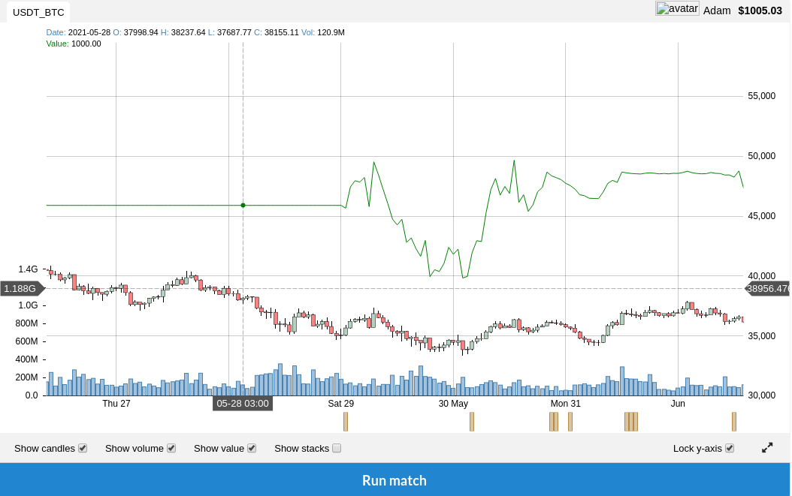
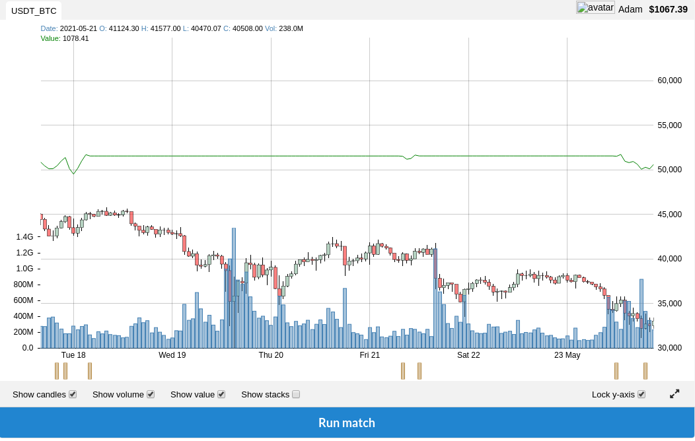
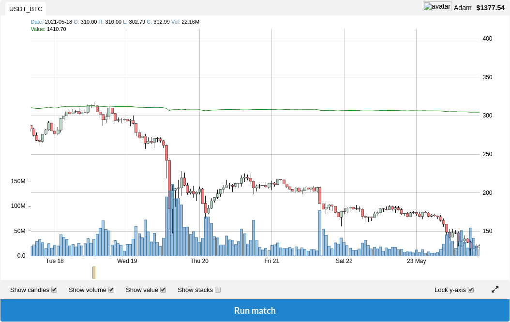

# Trading Bot

## Summary

- [Trading Bot](#trading-bot)
- [Summary](#summary)
- [Other Documentation](#other-documentation)
- [Introduction](#introduction)
- [Algorithm](#algorithm)
- [Results](#results)
- [Authors](#authors)

## Other Documentation

- [How robot works](./doc/how_robot_works.md)

## Introduction

This project consists of creating a robot that analyses a financial market to determine the actions to be taken.

In the case of an `Epitech`, we had to create an algorithm to win the more `money` possible.

From $1,000 upwards, our algorithm must limit losses and win as much as possible at the same time.

## Algorithm

The algorithm is based on the `MACD` indicator and `Candle analysis`.

The `MACD` indicator is a trend indicator that shows the relationship between two moving averages of a security’s price. The `MACD` is calculated by subtracting the 26-period `EMA` from the 12-period `EMA`.

The `Candle analysis` is a method of technical analysis used to study the price movement of a security. The candlestick chart is a type of financial chart that is used to represent the price movement of a security.

### Risk Management

The algorithm uses a `stop loss` and `take profit` to limit losses and win as much as possible.

The `stop loss` is a risk management tool that helps you reduce your losses. It is a predetermined point at which a trader will exit a trade in a losing position.

These limits allow the algorithm to limit losses and win as much as possible, but also limit gains.

## Results

Our algorithm has been tested on the `USDT-BTC` from Epitech dataset and `generated` datasets.

Test on first Epitech dataset:

  

Test on second Epitech dataset:

  

Test on third Epitech dataset:

On this dataset our algorithm could make `155% profit` but it was limited by the `stop loss` and `take profit`.

  

## Authors

- [**Romain Chevallier**](https://github.com/rchevallier1234)
- [**Adam Lesage**](https://github.com/AdamLesage)

## License

This project is licensed under the MIT License - see the [LICENSE](LICENSE) file for details.