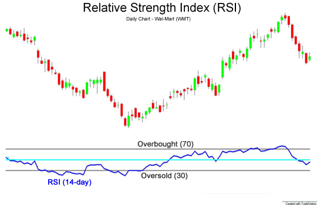

# How our trading robot works

Our trading robot is a program that automatically trades on your behalf. It uses a set of rules to decide when to buy or sell assets. The robot can be customized to your preferences and can be set to trade on different exchanges.

For this project, we decided to use Python as the programming language for our trading robot. Python is a popular language for algorithmic trading because it is easy to learn and has a large number of libraries for data analysis and machine learning.
Thanks to Python, our robot will be a class with many methods and attributes that will allow us to interact with the market and make trades.

### Example of a simple trading robot

```python
class Bot:
    def __init__(self):
        """ Initialize the bot object """
        self.botState = BotState()

    def run(self):
        """ Main loop of the bot and will call functions to make trades """
        pass

    def parse(self, info: str):
        """ Parse the information received from the exchange """
        pass


class Candle:
    def __init__(self, format, intel):
        """ Initialize the candle object """
        pass

    def __repr__(self):
        """ Return a string representation of the candle object """
        return str(self.pair) + str(self.date) + str(self.close) + str(self.volume)
```

## How it works

Our trading robot uses a set of rules to decide when to buy or sell assets. These rules are based on technical analysis and market data. The robot can be customized to your preferences and can be set to trade on different exchanges.

Based on its algorithms chosen, the robot will analyze the market data and make trades accordingly. The robot can be set to trade on different exchanges and can be customized to your preferences.

## Algorithms

The goal is to win more trades than we lose. To achieve this, we use a set of algorithms that analyze the market data and make trades accordingly. These algorithms are based on technical analysis and market data.

For our robot, we searched for various and we found the following algorithms:

- [Moving Average Convergence Divergence (MACD)](https://en.wikipedia.org/wiki/MACD)
- [Relative Strength Index (RSI)](https://fr.wikipedia.org/wiki/Relative_strength_index)
- [Bollinger Bands](https://en.wikipedia.org/wiki/Bollinger_Bands)
- [Stochastic Oscillator](https://en.wikipedia.org/wiki/Stochastic_oscillator)

These algorithms are used to analyze the market data and make trades accordingly. The robot can be customized to your preferences and can be set to trade on different exchanges.

### Moving Average Convergence Divergence (MACD)

The Moving Average Convergence Divergence (MACD) is a trend-following momentum indicator used in technical analysis.
It shows the relationship between two moving averages of a security's price.
The MACD is calculated by subtracting the 26-period Exponential Moving Average (EMA) from the 12-period EMA.
A nine-day EMA of the MACD, called the "signal line," is then plotted on top of the MACD line.
Traders use the MACD to identify potential buy and sell signals.
When the MACD crosses above the signal line, it suggests a bullish signal (buy).
Conversely, when the MACD crosses below the signal line, it indicates a bearish signal (sell).

<p align="center">
    
</p>

### Relative Strength Index (RSI)

The Relative Strength Index (RSI) is a momentum oscillator that measures the speed and change of price movements.
The RSI oscillates between zero and 100.
Traditionally, and according to Wilder, RSI is considered overbought when above 70 and oversold when below 30.
The RSI provides signals that tell traders to buy when the security is oversold and to sell when it is overbought.

<p align="center">
    
</p>

### Bollinger Bands

Bollinger Bands are a type of statistical chart characterizing the prices and volatility over time of a financial instrument or commodity, using a formulaic method propounded by John Bollinger in the 1980s.
Financial traders employ these charts as a methodical tool to inform trading decisions, control automated trading systems, or as a component of technical analysis.
Bollinger Bands display a graphical band (the envelope maximum and minimum of moving averages, similar to Keltner or Donchian channels) and volatility (expressed by the width of the envelope) in one two-dimensional chart.

<p align="center">
    
</p>

### Stochastic Oscillator

The Stochastic Oscillator is a momentum indicator that shows the location of the close relative to the high-low range over a set number of periods.
According to an interview with Lane, the Stochastic Oscillator "doesn't follow price, it doesn't follow volume or anything like that.
It follows the speed or the momentum of price.
As a rule, the momentum changes direction before the price."
As such, bullish and bearish signals are generated to indicate possible changes in the trend.

<p align="center">
    
</p>

